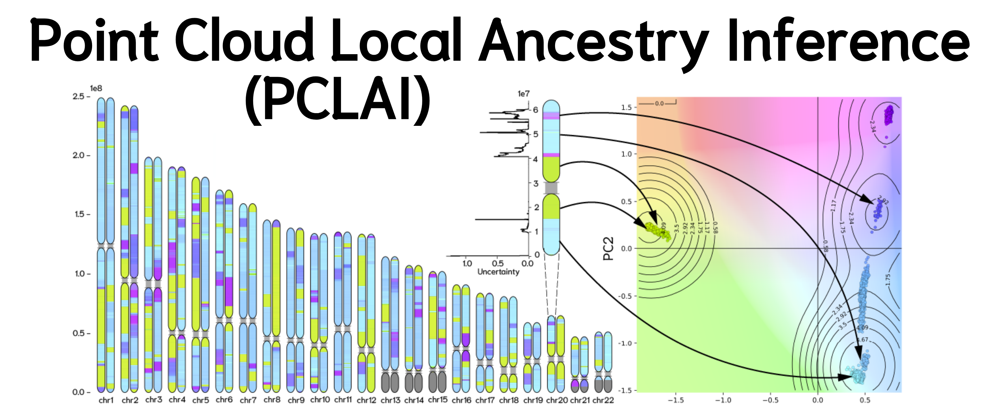

*Quick links:*
**Learn about the PCLAI HPRC v2 BED files:** [PCLAI on HPRC Release 2 samples](https://github.com/AI-sandbox/hprc-pclai) | **Preprint**: [TBD](https://github.com/AI-sandbox/pclai)

## Point Cloud Local Ancestry Inference (PCLAI)

Point cloud local ancestry inference (PCLAI) is a deep learning-based approach for inferring continuous population genetic structure along the genome. Instead of assigning each genomic window to a discrete ancestry label, PCLAI predicts a **continuous coordinate** (e.g., a point in PC1–PC2 space) for every window, together with a **per-window confidence score**.


## Cite

When using the [PCLAI method](https://github.com/AI-sandbox/pclai) or [PCLAI outputs](https://github.com/AI-sandbox/hprc-pclai), please cite the following paper:

```{tex}
@article{geleta_pclai_2026,
    author = {Geleta, Margarita and Mas Montserrat, Daniel and Ioannidis, Nilah M. and Ioannidis, Alexander G.},
    title = {{Point cloud local ancestry inference (PCLAI): coordinate-based ancestry along the genome}},
    year = {2026},
    journal = {https://github.com/AI-sandbox/pclai},
}
```
