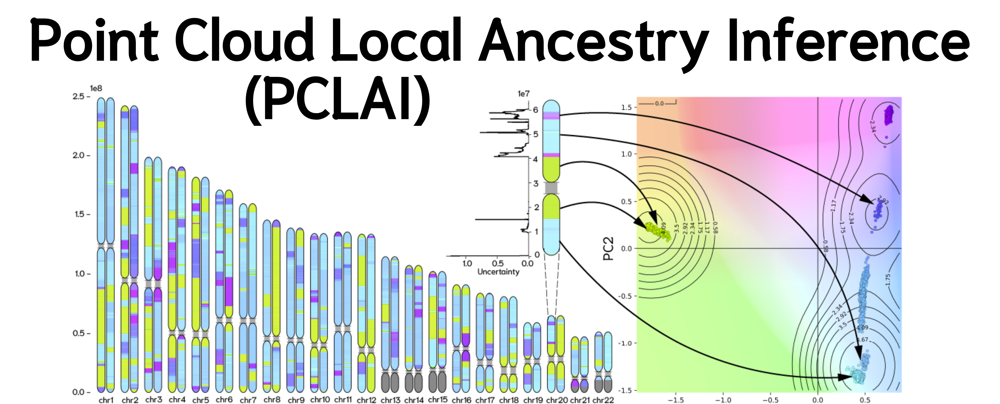

*Quick links:*
**Learn about the PCLAI HPRC v2 BED files:** [PCLAI on HPRC Release 2 samples](https://github.com/AI-sandbox/hprc-pclai) | **Preprint**: [biorxiv](https://www.biorxiv.org/content/10.64898/2026.03.23.713813v1)

## Point Cloud Local Ancestry Inference (PCLAI)

Point cloud local ancestry inference (PCLAI) is a deep learning-based approach for inferring continuous population genetic structure along the genome. Instead of assigning each genomic window to a discrete ancestry label, PCLAI predicts:
-  A **continuous coordinate** (e.g., a point in PC1–PC2 space) for every window, and 
- A **per-window confidence score**. 

For technical details, please see the [preprint](https://www.biorxiv.org/content/10.64898/2026.03.23.713813v1).

We are open for collaborations. If you require extra information to run the current pretrained models, please reach to `geleta@berkeley.edu`.

# Usage

PCLAI runs on [Python 3.12.10](https://www.python.org/downloads/). The harmonization pipeline uses [bcftools 1.13](https://www.htslib.org/download/), [Java openjdk 21.0.3](https://www.java.com/en/download/), and [BEAGLE](https://faculty.washington.edu/browning/beagle/beagle.html) (version 5.5). We recommend setting up a virtual environment and installing the required modules:

```bash
python3 -m pip install -r requirements.txt
```


## Using pre-trained PCLAI models

Using pre-trained PCLAI relies on two main workflows:

1. **Harmonization** of an arbitrary input VCF into the SNP space expected by a pretrained PCLAI bundle
2. **Inference** using a pretrained bundle on the harmonized VCFs

### Pretrained bundles

Currently, we provide four pretrained bundles:

- `pclai_1kg_bundle_cpu`: trained on 1000 Genomes for CPU inference ([download](bundles/pclai_1kg_bundle_cpu)).
- `pclai_1kg_bundle_cuda`: trained on 1000 Genomes for GPU inference ([download](https://drive.google.com/file/d/1VUrPMB8IoE9D6i-NdHx-FTWZH_FlL_zd/view?usp=sharing)).
- `pclai_1kg+hgdp_bundle_cpu`: trained on 1000 Genomes + Human Genome Diversity Project (HGDP) for CPU inference ([download](bundles/pclai_1kg+hgdp_bundle_cpu)).
- `pclai_1kg+hgdp_bundle_cuda`: trained on 1000 Genomes + Human Genome Diversity Project (HGDP) for GPU inference ([download](bundles/pclai_1kg+hgdp_bundle_cuda)).

The CPU and CUDA bundles contain the same model family, but exported for different devices.

> [!IMPORTANT]
Use the CPU bundle if you will run inference on CPU, and the CUDA bundle if you will run inference on GPU.
Exported PyTorch programs are device-specialized, so a CPU bundle is not interchangeable with a CUDA bundle.

> [!TIP]
Because these bundles have different numbers of input SNPs, it is often useful to try both and compare which one gives better SNP coverage for your input VCF.

### Bundle format

Each bundle follows this structure:

```text
pclai_bundle/
  manifest.json
  snp_manifests/
    chr1_s01.snps.tsv
    chr1_s02.snps.tsv
    ...
    chr13.snps.tsv
    ...
  models/
    pclainet_chm1_s01.pt2
    pclainet_chm1_s02.pt2
    ...
```
#### `snp_manifests/`

The `snp_manifests/` directory contains the **exact ordered SNP list** expected by each exported model artifact. 

Each `.snps.tsv` file has this format:
```text
chrom   pos     rsid    ref     alt
chr21   5034221 .       G       A
chr21   5034230 .       C       T
chr21   5034244 .       C       T
```
These manifest files are the source of truth for:

+ Expected SNP identity
+ Expected SNP order

#### `models/`

The `models/` directory contains exported PyTorch model artifacts (`.pt2`) that can be loaded for inference.

#### `manifest.json`

The `manifest.json` file contains the overall bundle metadata, including:
+ Chromosome / subset mapping
+ Model artifact paths
+ SNP manifest paths
+ Expected SNP counts
+ Bundle-level configuration metadata

### Input requirements

Your input VCF must be harmonized to the model space before running inference. In practice, that means:

- [ ] **GRCh38** coordinates
- [ ] **Phased** haplotypes
- [ ] **Imputed** against the reference panel (1000 Genomes and/or HGDP)
- [ ] **Harmonized to the SNP order expected by the bundle**

If your VCF is already:

- [x] In GRCh38
- [x] Phased
- [x] Imputed
- [x] And already matches the SNP order expected by the bundle

Then you can skip harmonization and run inference directly.

Otherwise, run `pipeline.py` first.

> [!WARNING]
It is very likely you will need to run harmonization. **Do not run inference without harmonizing your VCF first**. 

> [!CAUTION]
Running inference without harmonization will lead to incorrect outputs.

#### Harmonization workflow

The harmonization pipeline does the following for each chromosome:

1. Extracts chromosome-specific variants from the input VCF
2. Aligns contig naming with the reference panel
3. Checks allele concordance against the bundle SNP manifest
4. Optionally normalizes the target VCF against a reference FASTA
5. Phases / imputes the target VCF (with BEAGLE5)
6. emits a final per-chromosome VCF in the exact SNP-manifest order expected by the bundle

##### External tools required

You will need:

- [x] BCFtools
- [x] java
- [x] BEAGLE5 (JAR file path)
- [x] A GRCh38 reference FASTA if using normalization (optional)
- [x] Reference panel VCFs for imputation (1000 Genomes and/or HGDP)

> [!IMPORTANT]
The reference panel VCFs used for imputation are not the same thing as the bundle SNP manifests. The bundle defines the final SNP order expected by the model The reference panel VCFs are used by BEAGLE for phasing/imputation

##### Expected input genome build
All pretrained bundles assume GRCh38 coordinates.
>[!IMPORTANT]
If your input VCF is not in GRCh38, harmonization will not be sufficient by itself.
You must first liftover or otherwise convert the data to GRCh38.

>[!NOTE]
Make sure your VCF contigs include the `chr` prefix (e.g., `chr1` instead of `1`): `##contig=<ID=chr1>`.


##### Running harmonization

```bash
python3 ./pipeline.py \
  --input-vcf "/path/to/input.vcf.gz" \
  --workdir "/path/to/workdir" \
  --bundle-dir "/path/to/pclai_bundle" \
  --reference-split-template "/path/to/reference.chr{chrom}.vcf.gz" \
  --impute-engine beagle \
  --beagle-jar "/path/to/beagle.jar" \
  --threads 16 \
  --reference-fasta "/path/to/GRCh38.fa" \
  --auto-normalize-on-qc-fail \
  --log-level DEBUG
```

- **`--bundle-dir`** points to one of the pretrained PCLAI bundles
- **`--reference-split-template`** points to the reference VCFs (1000 Genomes and/or HGDP) used for BEAGLE imputation. The path can be accept any pattern as long as it can iterate through the `{chrom}`s, because the code just does `.format(chrom=chrom)` on the string.
- **`--beagle-jar`** must point to a valid BEAGLE JAR
- **`--reference-fasta`** is used for optional target normalization
- **`--auto-normalize-on-qc-fail`** retries QC after normalization when needed

>[!IMPORTANT]
The harmonization pipeline assumes the input VCF is indexed and bgzip-compressed (`.vcf.gz`) or otherwise readable by bcftools. If your input is a plain `.vcf`, compress and index it first.

For example:
```bash
bgzip -c input.vcf > input.vcf.gz
bcftools index -t input.vcf.gz
```

#### Harmonized output format

After harmonization, you should have per-chromosome VCFs under your work directory:
```bash
/path/to/workdir/
  chr1/final.for_model.chr1.vcf.gz
  chr2/final.for_model.chr2.vcf.gz
  ...
```
These per-chromosome VCFs are in the exact SNP order expected by the bundle and can be passed directly to the inference runner.

#### TL;DR

If you have an arbitrary input VCF and want to run our pretrained models:

1. Choose a bundle
    - `pclai_1kg_cpu`
    - `pclai_1kg_cuda`
    - `pclai_1kg+hgdp_cpu`
    - `pclai_1kg+hgdp_cuda`
2. Harmonize your input VCF with `pipeline.py` if needed
3. Collect the harmonized per-chromosome VCFs into a folder
4. Run `inference.py` on that folder
5. Save the outputs for downstream analysis and plotting

#### Running inference

The `inference.py` module provides a command-line interface with two modes:

- `run-chrom`: run one chromosome VCF against the corresponding chromosome bundle
- `run-dir`: run a directory of chromosome VCFs

##### Single chromosome:
```bash
python3 inference.py run-chrom \
  --bundle-dir /path/to/pclai_bundle_cuda \
  --vcf-path /path/to/chr21.vcf.gz \
  --chrom 21 \
  --device cuda \
  --outdir /path/to/output_chr21
```

##### Whole VCF directory:
```bash
python3 inference.py run-dir \
  --bundle-dir /path/to/pclai_bundle_cuda \
  --vcf-dir /path/to/my_vcfs \
  --device cuda \
  --outdir /path/to/output_all
```

##### Selected chromosomes only:
```bash
python3 inference.py run-dir \
  --bundle-dir /path/to/pclai_bundle_cuda \
  --vcf-dir /path/to/my_vcfs \
  --device cuda \
  --chroms 21,22 \
  --outdir /path/to/output_chr21_chr22
```

> [!IMPORTANT]
Use `--device cpu` with a CPU bundle and `--device cuda` with a CUDA bundle.

##### Inference output files

Each inference run writes:
```text
outdir/
  results.pkl.gz
  results_cp.pkl.gz
  stats.tsv
  metadata.json
```
- **`results.pkl.gz`**: nested dictionary with local ancestry coordinates
- **`results_cp.pkl.gz`**: nested dictionary with breakpoint logits
- **`stats.tsv`**: tabular summary of SNP matching / coverage for each chromosome or subset
- **`metadata.json`**: run configuration and paths

##### Loading saved outputs

```python
from inference import load_inference_outputs

results, results_cp, stats_df, metadata = load_inference_outputs("/path/to/output_dir")
```

**`results`** is a nested dictionary with structure:

```python
results[sample_id][chrom]["h1"] -> np.ndarray of shape (n_windows, 2)
results[sample_id][chrom]["h2"] -> np.ndarray of shape (n_windows, 2)
```
Example:
```python
results["ID2462"]["chr21"]["h1"]
```
Returns an array of shape `(n_windows, 2)`, where each row is the 2D coordinate predicted by the model for one window on haplotype 1.

- Column 0: first PCA coordinate
- Column 1: second PCA coordinate

`h2` is the same for haplotype 2.

**`results_cp`** is a nested dictionary with structure:
```python
results_cp[sample_id][chrom]["h1"] -> np.ndarray of shape (n_windows,)
results_cp[sample_id][chrom]["h2"] -> np.ndarray of shape (n_windows,)
```
Example:
```python
results_cp["KPP2462"]["chr21"]["h1"]
```
returns a 1D array of logits. 


### Training PCLAI on custom datasets
Soon!

### Inferring PCLAI coordinates
Soon!

### Demo
Soon!

### License
**NOTICE**: This software is available for use free of charge for academic research use only. Academic users may fork this repository and modify and improve to suit their research needs, but also inherit these terms and must include a licensing notice to that effect. Commercial users, for profit companies or consultants, and non-profit institutions not qualifying as "academic research" should contact `geleta@berkeley.edu`. This applies to this repository directly and any other repository that includes source, executables, or git commands that pull/clone this repository as part of its function. Such repositories, whether ours or others, must include this notice.


## Cite

When using the [PCLAI method](https://github.com/AI-sandbox/pclai) or [PCLAI outputs](https://github.com/AI-sandbox/hprc-pclai), please cite the following paper:

```{tex}
@article{geleta_pclai_2026,
    author = {Geleta, Margarita and Mas Montserrat, Daniel and Ioannidis, Nilah M. and Ioannidis, Alexander G.},
    title = {{Point cloud local ancestry inference (PCLAI): continuous coordinate-based ancestry along the genome}},
    year = {2026},
    journal = {biorxiv},
    doi={10.64898/2026.03.23.713813}
}
```
